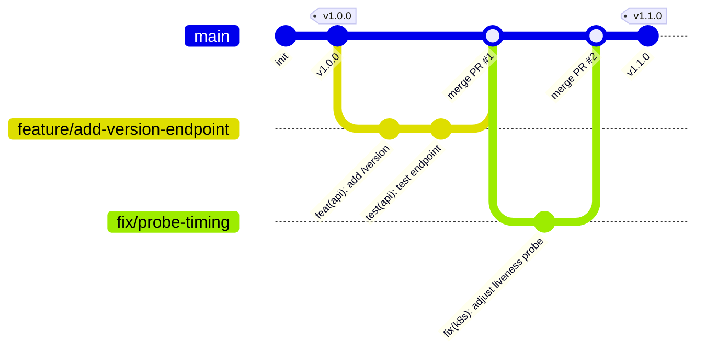

# Git & DevOps Workflow Guide

This guide establishes the Git branching model, commit conventions, pull request lifecycles, and operational workflows for this repository.

> ### 📚 Documentation Hub
> - 📘 **GitHub Actions Core Guide**: [Readme.md](Readme.md)
> - 🚀 **DevOps Demo Architecture & Setup**: [architecture.md](architecture.md)
> - 🌿 **Git & Branching Workflow**: [GIT.md](GIT.md)
> - 🛡️ **DevSecOps Architecture & Policy**: [SECURITY.md](SECURITY.md)
> - ⚠️ **Gotchas & Critical Notes**: [note.md](note.md)
> - 🏗️ **Real-World Pipeline Blueprint**: [real-world-proj.md](real-world-proj.md)

---

## 1. Branching Strategy (Trunk-Based / GitHub Flow)

We follow a **Trunk-Based Development** model with short-lived feature branches:



### Branch Naming Rules
- `feature/<short-description>`: New features or endpoints (e.g. `feature/user-auth`)
- `fix/<short-description>`: Bug fixes (e.g. `fix/health-check-timeout`)
- `ci/<short-description>`: Workflow and pipeline adjustments (e.g. `ci/add-trivy-scan`)
- `k8s/<short-description>`: Manifest and Kustomize changes (e.g. `k8s/bump-prod-replicas`)
- `chore/<short-description>`: Maintenance, dependency updates (e.g. `chore/upgrade-node-22`)

---

## 2. Commit Message Standards (Conventional Commits)

All commits must follow the **Conventional Commits** specification:

```
<type>(<scope>): <short description in imperative mood>

[optional body explaining WHY the change was made]

[optional footer(s), e.g. Fixes #123, BREAKING CHANGE]
```

### Types
| Type | Description | Example |
| :--- | :--- | :--- |
| `feat` | New user-facing feature or API capability | `feat(api): add /version endpoint` |
| `fix` | Bug fix in code or manifests | `fix(k8s): set correct containerPort to 3000` |
| `ci` | Changes to GitHub workflows, actions, or linters | `ci(pipeline): add kubeconform validation step` |
| `test` | Adding or updating unit/integration tests | `test(app): add test case for status endpoint` |
| `refactor`| Code change that neither fixes a bug nor adds a feature | `refactor(server): extract route handlers` |
| `chore` | Dependency bumps, build configs, tool updates | `chore(npm): bump express from 4.19 to 4.20` |
| `docs` | Documentation changes only | `docs(readme): add Kubernetes architecture section` |

---

## 3. Pull Request & Quality Gates

Every pull request triggers automated CI validation:

1. **Lint Job**: Validates YAML syntax (`yamllint`), GitHub Actions schema (`check-jsonschema`), and Kubernetes overlays (`kubeconform`).
2. **Test Matrix**: Executes `npm test` across Node.js `20` and `22`.
3. **Security Scan**: CodeQL analysis, dependency vulnerability check, and Gitleaks secret scan.
4. **CI-OK Gate**: The `ci-ok` job acts as the single required branch protection status check.

### Branch Protection Configuration
In GitHub Repository Settings (`Settings -> Branches -> Branch protection rules`):
- **Branch name pattern**: `main`
- **Require a pull request before merging**: Enabled
- **Require status checks to pass before merging**:
  - `ci-ok` (Required)
  - `CodeQL Scan` (Required)
  - `Dependency Review` (Required)
  - `Gitleaks Scan` (Required)
- **Do not allow bypassing the above settings**: Enabled

---

## 4. GitOps & Release Lifecycle

1. **Feature Merge**: When a PR is approved and merged into `main`:
   - Docker image is built using Buildx.
   - Tagged with short commit SHA (`type=sha,format=short`).
   - Pushed to GitHub Container Registry (`ghcr.io/<org>/<repo>/api`).
2. **Security Gating**: Trivy scans the newly built image digest.
3. **Automatic Staging Rollout**:
   - `kustomize edit set image app=<image>@<digest>` runs on `k8s/overlays/staging`.
   - Applied via `kubectl apply -k k8s/overlays/staging`.
   - Verified with smoke test polling `/version` against `github.sha`.
4. **Production Deployment**:
   - Requires manual reviewer approval configured in the `prod` GitHub environment.
   - Deploys with 4 replicas to `k8s/overlays/prod`.
   - Automatically rolls back if rollout or smoke test fails.

---

## 5. Security & Secret Hygiene

- **Never Commit Secrets**: Do not commit API tokens, passwords, `.env` files, or kubeconfigs.
- **Local Secret Scanning**: Run Gitleaks locally before committing:
  ```bash
  gitleaks detect --source . -v
  ```
- **Secret Handling in CI**:
  - Store sensitive credentials in **GitHub Repository Secrets** (`KUBE_CONFIG`, `CR_PAT`).
  - Use `${{ secrets.GITHUB_TOKEN }}` for built-in repository permissions.
  - Never echo or print secrets in `run:` scripts.
  - Always pass pipeline variables via `env:` rather than inline string replacement (`${{ ... }}`) in bash scripts.

---

## 6. Daily Git Cheat Sheet

### Working with Branches
```bash
# Update local main
git checkout main
git pull origin main

# Create and switch to a new feature branch
git checkout -b feature/health-improvements

# Push branch and set upstream tracking
git push -u origin feature/health-improvements
```

### Keeping Branches Updated (Rebase)
```bash
# Fetch latest main without switching
git fetch origin main

# Rebase current feature branch onto updated main
git rebase origin/main

# If conflicts occur: resolve conflicts, stage files, and continue
git add <resolved-file>
git rebase --continue
```

### Stashing Changes
```bash
# Save uncommitted work
git stash push -m "WIP: working on dockerfile"

# List stashes
git stash list

# Re-apply stashed work
git stash pop
```

### Cleaning Up & Undoing
```bash
# Amend last commit message or add forgotten file
git add .
git commit --amend --no-edit

# Undo the last commit keeping changes staged
git reset --soft HEAD~1

# Discard changes to a specific file
git restore path/to/file

# Safely revert a commit on main
git revert <commit-sha>
```

### GitHub CLI (`gh`) Shortcuts
```bash
# Create a PR interactively
gh pr create --fill

# View status of PR checks
gh pr checks

# Manually trigger a workflow
gh workflow run pipeline.yml

# Watch real-time execution of the latest workflow run
gh run watch
```
