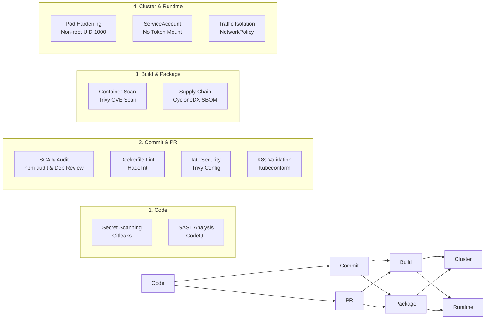

# DevSecOps & Security Policy

This document outlines the security architecture, controls, automated testing gates, and vulnerability disclosure policies implemented across this project.

> ### 📚 Documentation Hub
> - 📘 **GitHub Actions Core Guide**: [Readme.md](Readme.md)
> - 🚀 **DevOps Demo Architecture & Setup**: [architecture.md](architecture.md)
> - 🌿 **Git & Branching Workflow**: [GIT.md](GIT.md)
> - 🛡️ **DevSecOps Architecture & Policy**: [SECURITY.md](SECURITY.md)
> - ⚠️ **Gotchas & Critical Notes**: [note.md](note.md)
> - 🏗️ **Real-World Pipeline Blueprint**: [real-world-proj.md](real-world-proj.md)

---

## 1. DevSecOps Architecture & Shift-Left Model

Security is built into every stage of the software delivery lifecycle (SDLC) rather than bolted on at deployment:

---

## 2. Security Controls Across the Delivery Pipeline

### Phase 1: Code & Developer Workstation
- **Secret Scanning**:
  - Gitleaks detects hardcoded API tokens, SSH keys, certificates, and credentials before commits are pushed.
  - Run locally: `gitleaks detect --source . -v`
- **Static Application Security Testing (SAST)**:
  - GitHub CodeQL continuously scans JavaScript/TypeScript code for injection flaws, prototype pollution, and data sanitization issues.

### Phase 2: Pull Request & CI Gates
- **Software Composition Analysis (SCA)**:
  - `npm audit --audit-level=high` runs in the test matrix to catch known CVEs in third-party packages.
  - GitHub Dependency Review action blocks pull requests introducing vulnerable libraries or risky open-source licenses.
  - Dependabot scans dependencies weekly across npm, GitHub Actions, and Docker base images.
- **Dockerfile Linter (Hadolint)**:
  - Enforces container build best practices, preventing root execution, unpinned versions, and unsafe shell invocations.
- **Infrastructure as Code (IaC) Scanning**:
  - Trivy Config scans Kubernetes manifests and YAML files for security misconfigurations.
  - Kubeconform verifies Kubernetes schema integrity against the official Kubernetes OpenAPI specs.

### Phase 3: Build & Image Security
- **Container Vulnerability Scanning**:
  - Trivy scans the compiled container image on GHCR for `HIGH` and `CRITICAL` CVEs with `--exit-code 1` gating.
- **Software Supply Chain Security (SBOM)**:
  - Automated generation of a **CycloneDX Software Bill of Materials (SBOM)** (`sbom.cdx.json`) for every production image build.
  - Pinned digests (`image@sha256:...`) prevent tag mutability attacks.

### Phase 4: Kubernetes Runtime Hardening
- **Least Privilege Pod Security Context**:
  - `runAsNonRoot: true`: Prevents containers from running as root.
  - `runAsUser: 1000`: Runs as unprivileged application user.
  - `allowPrivilegeEscalation: false`: Blocks setuid/setgid binary escalation.
  - `readOnlyRootFilesystem: true`: Locks filesystem from runtime modification.
  - `capabilities.drop: ["ALL"]`: Drops all Linux kernel capabilities.
- **Token Protection**:
  - Custom `ServiceAccount` (`demo-sa`) with `automountServiceAccountToken: false` eliminates credential exfiltration risk.
- **Network Segmentation**:
  - Kubernetes `NetworkPolicy` (`demo-netpol`) applies default-deny ingress (allowing only port 3000) and limits egress strictly to DNS (port 53).

---

## 3. Vulnerability Management SLA

| Severity | Definition | Remediation SLA |
| :--- | :--- | :--- |
| **CRITICAL** | Remote Code Execution, Auth Bypass, Exploited in Wild | **24 hours** |
| **HIGH** | Privilege Escalation, Denial of Service, High-Impact CVE | **7 days** |
| **MEDIUM** | Information Disclosure under specific configurations | **30 days** |
| **LOW** | Minor security hygiene, low exploitability | Next release cycle |

---

## 4. Reporting Security Vulnerabilities

If you discover a security vulnerability, please do **NOT** open a public issue.

1. Send details privately via email to `security@example.com` or via GitHub Private Vulnerability Reporting.
2. Include:
   - Description of the vulnerability and attack vector.
   - Proof of Concept (PoC) steps or script.
   - Potential impact and affected components.
3. The security team will acknowledge receipt within 24 hours and provide regular status updates until patched.
