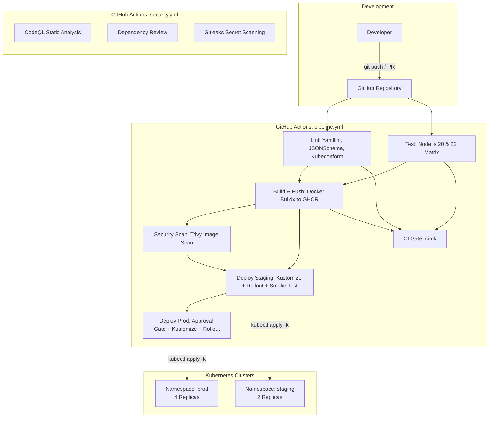

# DevOps Demo: Production-Ready CI/CD & GitOps Pipeline

A production-grade microservice architecture and deployment pipeline demonstrating automated testing, multi-stage containerization, vulnerability scanning, GitOps deployment with Kustomize, and continuous security scanning.

> ### 📚 Documentation Hub
> - 📘 **GitHub Actions Core Guide**: [Readme.md](Readme.md)
> - 🚀 **DevOps Demo Architecture & Setup**: [architecture.md](architecture.md)
> - 🌿 **Git & Branching Workflow**: [GIT.md](GIT.md)
> - 🛡️ **DevSecOps Architecture & Policy**: [SECURITY.md](SECURITY.md)
> - ⚠️ **Gotchas & Critical Notes**: [note.md](note.md)
> - 🏗️ **Real-World Pipeline Blueprint**: [real-world-proj.md](real-world-proj.md)

---

## Architecture Overview



---

## Repository Structure

```
devops-demo/
├── .github/
│   ├── actions/
│   │   └── deploy/
│   │       └── action.yml        # Composite action: configure kubectl, pin image, apply, smoke test
│   ├── dependabot.yml            # Automated weekly dependency updates (actions, npm, docker)
│   └── workflows/
│       ├── pipeline.yml          # Core CI/CD: lint, test, build, scan, staging & prod deploy
│       └── security.yml          # Security suite: CodeQL, Dependency Review, Gitleaks
├── app/
│   ├── .dockerignore             # Excludes node_modules, tests, k8s, git from image context
│   ├── Dockerfile                # Multi-stage production build (Node 22 Alpine, non-root user)
│   ├── package.json              # Express application config & test scripts
│   ├── package-lock.json         # Pinned dependency tree for deterministic npm ci
│   ├── server.js                 # Express server with /health and /version endpoints
│   └── server.test.js            # Native Node.js test suite for /health and /version
├── k8s/
│   ├── base/
│   │   ├── deployment.yaml       # Hardened Deployment: security context, probes, resource limits
│   │   ├── kustomization.yaml    # Base Kustomization referencing manifests
│   │   ├── networkpolicy.yaml    # Network segmentation (ingress 3000, egress DNS only)
│   │   ├── service.yaml          # Service exposing container port 3000 on port 80
│   │   └── serviceaccount.yaml   # Explicit ServiceAccount with automount token disabled
│   └── overlays/
│       ├── prod/
│       │   └── kustomization.yaml# Prod overlay: namespace prod, scaled to 4 replicas
│       └── staging/
│           └── kustomization.yaml# Staging overlay: namespace staging, default 2 replicas
├── .gitignore                    # Git ignore file for node_modules and logs
├── .yamllint                     # Strict YAML lint configuration with truthy & length rules
├── architecture.md               # DevOps demo architecture & setup documentation
├── GIT.md                        # Git branching strategy, commit standards, and workflow guide
├── note.md                       # Gotchas and important rules in GitHub Actions
├── Readme.md                     # Comprehensive GitHub Actions master guide
├── real-world-proj.md            # Real-world pipeline blueprint and reference
└── SECURITY.md                   # DevSecOps architecture, security gates, and vulnerability policy
```

---

## Application & Services

### Express API (`app/server.js`)
Lightweight microservice with zero bloat, exposing operational endpoints:
- `GET /health` &rarr; `{"status":"ok"}`: Used by Kubernetes readiness & liveness probes.
- `GET /version` &rarr; `{"version":"<APP_VERSION>"}`: Injected at build time via `APP_VERSION` arg to verify live rollouts.

### Docker Multi-Stage Build (`app/Dockerfile`)
1. **Stage 1 (`deps`)**: Installs production dependencies using `npm ci --omit=dev`.
2. **Stage 2 (`runtime`)**: Minimal Node 22 Alpine base, copies only necessary artifacts, runs as non-root UID `1000`, exposes port `3000`.

---

## Kubernetes Architecture (GitOps with Kustomize)

- **Declarative Base**: `k8s/base/` configures hardened pod security contexts (`runAsNonRoot: true`, `readOnlyRootFilesystem: true`, `drop: ["ALL"]`, `allowPrivilegeEscalation: false`).
- **Resource Constraints**: Requests (50m CPU, 64Mi RAM) and limits (250m CPU, 128Mi RAM).
- **Environment Overlays**:
  - `staging`: Deploys to `staging` namespace with 2 replicas.
  - `prod`: Deploys to `prod` namespace with 4 replicas.
- **Dynamic Image Pinning**: The deployment composite action executes `kustomize edit set image app=${IMAGE}` using the immutable digest (`@sha256:...`) before applying.

---

## CI/CD Pipeline Breakdown

### 1. Verification (`pipeline.yml`)
- **Lint**: Strict YAML verification with `yamllint`, workflow schema validation with `check-jsonschema`, action validation with `actionlint`, Dockerfile security linting with `hadolint`, and manifest schema checking with `kubeconform`.
- **Test**: Matrix test across Node.js versions `20` and `22` with cached dependencies, plus automated dependency vulnerability auditing via `npm audit`.
- **Build**: Multi-platform build via Docker Buildx with GitHub Actions caching (`cache-to: type=gha,mode=max`), tagged by commit SHA and published to GHCR.
- **Scan**: Trivy vulnerability scan checking for `HIGH` and `CRITICAL` CVEs before promotion, and automated generation and artifact upload of a **CycloneDX Software Bill of Materials (SBOM)**.
- **Deploy (Staging & Prod)**: Executes [`.github/actions/deploy`](.github/actions/deploy/action.yml), running:
  1. `kubectl config` setup with chmod 600.
  2. Kustomize image update and `kubeconform` manifest validation.
  3. `kubectl diff` change preview.
  4. `kubectl apply -k` and `kubectl rollout status` monitoring.
  5. 10-attempt smoke test verifying `GET /version` matches the deployed `github.sha`.
  6. Automatic `kubectl rollout undo` rollback on failure.

### 2. Security Workflows (`security.yml`)
- **CodeQL**: Deep semantic code analysis for Javascript/Typescript vulnerabilities.
- **Dependency Review**: Blocks PRs that introduce vulnerable dependencies.
- **Gitleaks**: Scans commit history for hardcoded tokens, passwords, and private keys.
- **IaC & Config Scanning**: Trivy scanner analyzing Kubernetes manifests and configuration files for misconfigurations.
- Detailed architecture and vulnerability SLAs are documented in [`SECURITY.md`](SECURITY.md).

---

## Local Development & Testing

```bash
# 1. Install dependencies
cd app
npm install

# 2. Run unit tests
npm test

# 3. Start local development server
npm start

# 4. Validate YAML files
yamllint --strict -f github .

# 5. Validate Kubernetes overlays
kubectl kustomize k8s/overlays/staging
kubectl kustomize k8s/overlays/prod

# 6. Build Docker image locally
docker build -t devops-demo:dev --build-arg APP_VERSION=local app
```
